# _Anaconda_ Martial Arts Academy

_Anaconda_ Martial Arts Academy is a local school of martial arts located in Dublin 15, that teaches a combination of disciplines necessary to become a Mixed Martial Artist.
The goal of the academy however is not to train competition ready athletes but to help their members to get active and fit and receive all benefits of martial arts training, including building self-esteem and confidence.
The classes tought in the academy are: Brazilian Jiu Jitsu, Kickboxing and Boxing and also MMA for the more advanced students.
Members can practice one chosen discipline or get involved with the whole MMA suite of disciplines.
The school accepts new members across all ages (in BJJ classes, kids can start as early as the age of 4) and various skill levels from Beginners to Advanced.
As 'Anaconda' academy is growing in members, they want to redesign their existing website and bring it up to todays standards in terms of look, responsiveness, user experience and SEO.

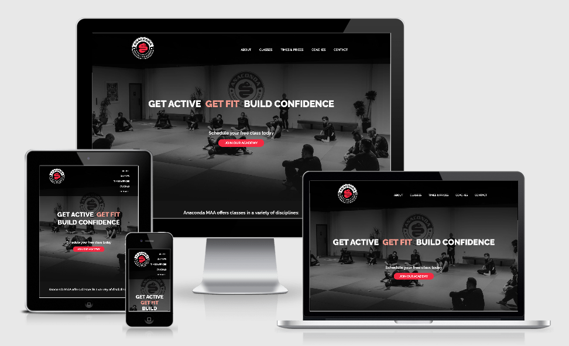

# Link to live project - [CLICK HERE](https://lukaszpasich.github.io/Anaconda-MAA-MS1/index.html) 

#### Contents
1. [UX](#ux)
	- [User Goals (Strategy)](#user-goals)
	- [Stakeholder Goals (Strategy)](#stakeholder-goals)
	- [User Stories (Strategy)](#user-stories)
	- [Project Scope (Scope)](#project-scope)
	- [Information Architecture and Interaction Design (Structure)](#information-architecture-and-interaction-design)
	- [Wireframes (low fidelity wireframes) (Skeleton)](#wireframes-(low-fidelity))
	- [Prototype (high fidelity wireframes) (Skeleton)](#prototype-(high-fidelity))
	- [Design (Surface)](#design)
2. [Features](#features)
	- [Navigation Bar](#navigation-bar)
	- [Footer](#footer)
	- ['Join Academy' call to action button](#'join-academy'-call-to-action-button)
	- [Home Page](#home-page)
	- [About Page](#about-page)
	- [Classes Page](#classes-page)
	- [Times & Prices Page](#times-and-prices-page)
	- [Coaches Page](#coaches-page)
	- [Contact Page](#contact-page)
	- [Contact Form](#contact-form)
	- [Google Maps Location Map](#google-maps-location-map)
	- [Favicon](#favicon)
	- [Features to Implement in the Future](#features-to-implement-in-the-future)
3. [Technologies](#technologies)
	- [Tools](#tools)
	- [Libraries](#libraries)
	- [Languages](#languages)
4. [Testing](#testing)
	- [Automated Testing](#automated-testing)
	- [UX Testing](#ux-testing)
	- [Manual Testing](#manual-testing)
	- [Bugs](#bugs)
5. [Deployment](#deployment)
6. [Credits](#credits)
	- [Content](#content)
	- [Media](#images)
	- [Code](#code)
    - [Resorces](#resources)
	- [Acknowledgements](#acknowledgements)

---

## UX

### User Goals
- Find out information about the academy and it's procedures.
- Find out information on classes provided and instructors providing the classes.
- Find out information about age groups and skill levels that classes are divided into. 
- Find out timetable of classes.
- Get an idea of membership prices. 
- Find information on how to get in touch with the school and start the training.
- Get the feel for the academy - is this academy for me / for my child?
- Get the feel for the academy - is it friendly and open to all members of the public or more of an elitist school for people 'in the know'? 

### Stakeholder Goals
- Attracting new members to join the academy.
- Retaining existing members.
- Providing comprehensive information about the academy to answer all the initial questions vistors may have.
- Increasing an online presence as a tool of advertising and promotion.
- Processing membership payments on the website would be a plus.

### User Stories

1. As a user of the website I want the information to be laid out clearly, visually structured in a way that makes sense, so that I am not confused by it and put off from using the website.
2. As a user of the website I want it to be easy to navigate, so that I can find what I'm looking for easily. 
3. As a novice to martial arts, I would like to find out what skill levels the school caters for, so that I'm encouraged to start the training and won't feel intimidated.
4. As someone with previous experience in martial arts, I want to make sure that the school provides training in the full suit of Mixed Martial Art disciplines
and that instructors are experienced and at a high level of competency, so that I could potentially get to the competing level in the Mixed Martial Arts.
5. As a parent of a primary school age child, I want to find out if the school provides classes for different age groups, to make sure that my child could train with the peers at the similar level of development.
6. As a busy working adult who would like to start the training, I expect to find a time table of classes, to make sure first of all that it's is possible for me to attend the classes time-wise before I get in touch and start the process of becoming a member.
7. As a person who needs to budget carefully, I would like to know upfront the membership prices, so that I can make a decision based on that piece of information first, before I engage with the academy and start the process of becoming a member.
8. As a user accessing this site from a mobile phone or tablet, I want the site to be responsive, so that it is easy to navigate and use on smaller devices.
9. As a potential member trying to get in touch with the academy, I expect some sort of feedback or acknowledgement of my online query, so that I know it has been received by the school and I can expect it is being processed.
10. As a returning visitor, I expect to be able to check if the times of the classes have changed, look up information about the new instructors and be able to find the social media links to check for new posts, images and videos published bt the school.

### Project Scope
 Creating the website for _Anaconda_ Martial Arts Academy with the goal of attracting new members to the academy.
 The website should consist of 3-6 pages, making sure that it is clean looking, easy to navigate and responsive.
 An invitation to a introductory, free and no commitment session should be a prominent and (reasonably) frequently repeated element of the website.
 The following information must be included: some information about the school, information about the classes, classes timetable and membership prices.
 The culmination of the interaction with the website is the _Contact_ page, where users (potential new members) need to be able to find enough information,
 so that they could get in touch with the school through various channels (physical address, email address, telephone, social media channels, contact form).

### Information Architecture and Interaction Design

#### Site Map
The website is simple enough that I chose a hierarchical tree structure for it.
It is a standard structure with reduced complexity and any down sides this type of structure might have for mobile phone use are mitigated by the fact that each branch in this case is only one page long.
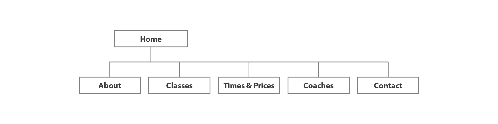

#### User Flow
The flow has been designed with visitors landing at the _Home_ page first in mind.
There is a possibility of visitors arriving to different pages first from social media links (through 'meet the new coach' or 'see our new times for kickboxing classes' types of posts) but navigating the website in those cases should still be simple enough.

__Navbar links__ connect all pages apart from _Home_ page.
To simplify the interaction I decided not to link _Home_ page there as it only acts as a nice landing, introduction page but it doesn't have any more information that visitors wouldn't find on other pages.
_Home page_ is still accessible by clicking on the logo or the link in the footer for visitors who are resolved to see it again. 

__Internal links__ connect some pages to create simple and logical user flow mini routes:
- User mini route 1 - About Martial Arts discipline:
	- _Home_ page -> read more about chosen martial art (takes visitor to _About_ page)
	- _About_ page: details about the martial art -> read about instructors (takes visitor to _Coaches_ page)
	- _Coaches_ page: details about instructors (a back-link to read about disciplines on _About_ page is here)

- User mini route 2 - About Classes:
	-  _Classes_ page: details about classes' age groups and skill levels -> find out times for the class you'd like to take (takes visitor to _Times & Prices_ page)
	- _Times & Prices_ page: details a about the class times
	
__'Join our academy' call to action button__ creates direct link to _Contact_ page for visitors who are decided to go to the next step towards becoming a member.

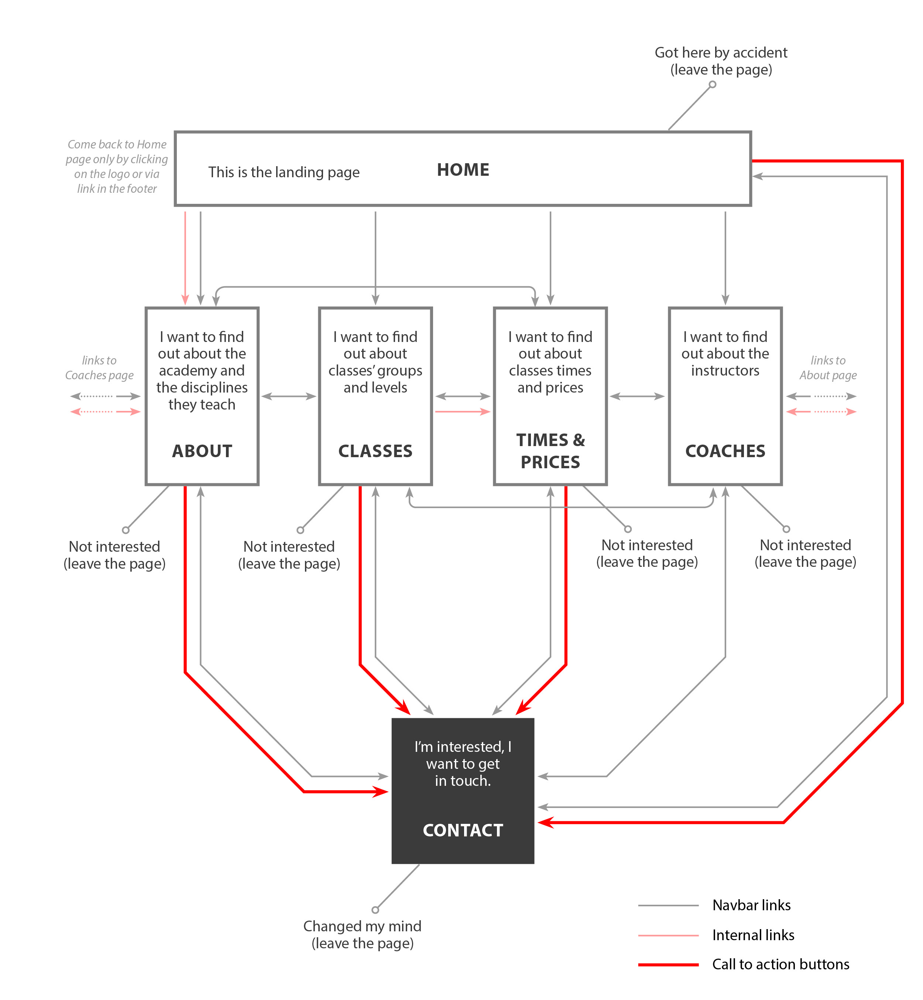

### Wireframes (low fidelity)
Wireframes created for 4 screen/ device sizes: desktop, tablet-landscape, tablet-portrait and phone.
- [Wireframes for all pages AVAILABLE HERE](https://indd.adobe.com/view/9dbb137a-4682-4b70-ab66-76e4a1d67484)

### Prototype (high fidelity)
Translating wireframes into the high fidelity prototype was an excellent exercise.
I got to see what worked in wireframes and what had to be tweaked. It was also good for deciding on, creating and populating all content and for solidifying the visual side.

After completing the prototype I had all my content, interaction and design decided on and finished.
At this point I was ready to move to pure code writing. 
- [Prototype - desktop version of the website AVAILABLE HERE](https://xd.adobe.com/view/b863cf46-772b-46b9-bb51-34d61b939cae-ed30/)
- [Prototype - mobile version of the website AVAILABLE HERE](https://xd.adobe.com/view/0e7b1086-38de-4079-a98a-e7318462fcea-5b28/)

### Design

#### The Name

Why Anaconda?

The martial art of Brazilian Jiu-Jitsu - one of the staples of the academy - is in essence the skill of grappling, holding and taking down the opponent to then force them into submission via joint lock or chokehold.
This very much resembles the actions of a constrictor snake and one of the submissions in BJJ is even called an _Anaconda Choke_. As grappling has become one of the key weapons in Mixed Martial Artist's arsenal, Brazilian Jiu-Jitsu became near synonymous with MMA and that's why I thought it was a good name for the Martial Arts Academy.

#### Logo
With the logo I was trying to emulate the classic idea of the Martial Arts Club badge which seems to have always evolved around some related image or an Asian symbol enclosed in a circle (or lately popular octagon), with the club name and all the necessary text wrapped around that circle.

Reference images:

Anaconda MAA final logo:

#### Colours
Principally white, red and black colour palette - these three colors are the first colors humans see as important.
With black and white representing the concept of dualism, describing how seemingly opposite or contrary forces may actually be complementary, interconnected, and interdependent in the natural world, and the red colour being universally seen as a sign of both life and aggression - 
the 3 colours have always been used in martial arts themes.

In my research of the competitor's websites, I discovered that these were the prevalent colours on all of those websites and the similar colour theme would also be possibly expected by the website user/ visitor, adding credibility to the brand, company and the website. 

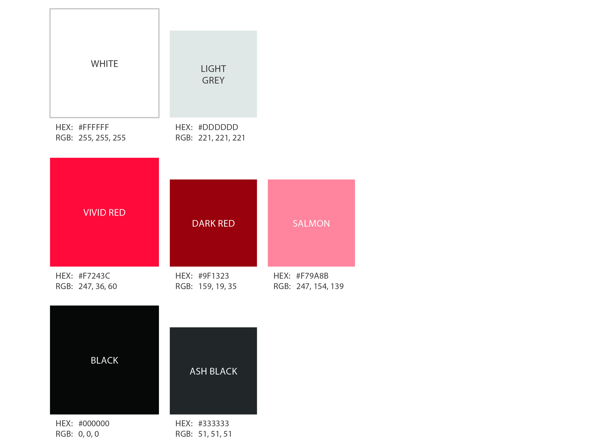

#### Typography
- Raleway: Semi-Bold, Bold and Extra Bold - for headlines and sub-headlines.

_Raleway_ because it is a nice and clean display typeface and also geometric sans-serif fonts (as _Raleway_ being geometric inspired) tend to have more neutral feel about them.
As Anaconda MAA aims at attracting a diverse audience, I didn't want to use font with too strong personality, because I wanted to convey an 'everybody is welcome' academy's approach to attracting it's new members.

- Roboto Slab: Regular - for body text.

_Roboto Slab_ has forms that are largely geometric, but at the same time, the font features friendly and open curves - it is an excellent body text font and a good compliment to Raleway.
Allowing letters to be settled into their natural width and with slab-serifs clearly defining the text baseline _Roboto_ creates an easy and more natural reading rhythm.

Both fonts and also their combination has been tried and is well established and widely popular on the web.

#### Images

Why black and white photography?

Black and white photography removes any distraction of color and helps the viewer focus on other aspects of the photo, such as the subject, the textures, shapes and patterns, and the composition.
It can convey remarkable purity of emotion and action and therefore works perfect for martial arts.

Black and white images look epic and historical. Using them in my website I wanted visitor to think "everyone in this image looks like a legend" and add on a deeper subconscious level "by joining this academy, I will become a legend too" :)

[Back to top](#contents)

---

## Features
### Navigation Bar
The navigation bar features elements:
- Logo - on the left-hand side; logo always links back to the _Home_ page.
- Navigation links - on the right-hand side, linking to all website pages:

	- About
	- Classes
	- Times & Prices
	- Coaches
	- Contact
	
Navigation links have _underline from center_ hover effect taken from Hover.css website (see [Credits/ Code section](#code)).
There is no effect for active navigation link, I decided that the headline of the header banner was sufficient to indicate the page that the visitor was in.
Hover effect on links on the other hand was important from the perspective of good UX.

The Navigation bar's position is fixed to allow for quick navigation between pages and to avoid using _back to top_ button.
The bar's opacity is set to 75% (0.75), so that any content that might obscured by it can be still visible (or at least possible to make out).

For narrow screens/ viewport sizes, the navigation links change from inline to stacked formation.

	
### Footer
The footer contains information (starting from the left):
- Logo - a black & white reversed version; appears right beside contact details (where it would be normally expected) but only on the widest screen size (over 1400px) as the space allows for it.
The logo disappears on the smaller screen/ viewport sizes to allow other elements of the footer to create a nicer and more organised structure.
Because the logo is also always present on the screen in the fixed position Navbar, the disappearance of the logo from the footer is not really an issue.
- Contact details - a physical address, phone number and email address of the business.
- Opening times
- Navigation links - stacked in a column, links are repeated for an added comfort of browsing between pages without having to move mouse to the top of the screen.
This also gives visitors a total view of all pages that the website has.
- Social media links - links to Twitter, Pinterest, Facebook, Instagram and Youtube will have to be linked later to the business' actual pages in the respective channels.

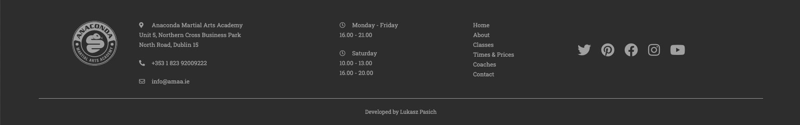

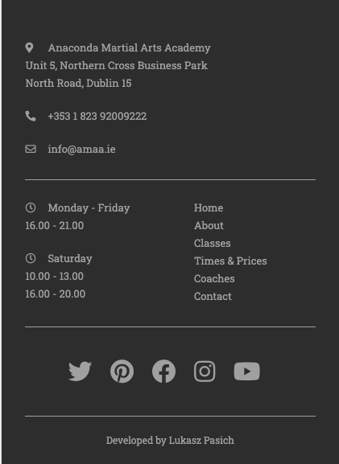

### 'Join Academy' call to action button
The business owner has asked to have a prominent and distinctive __'Join Our Academy'__ button repeated in few places across the whole website, on all or almost all of the pages.
The button also appears as __'Get Started'__ in the _Membership Prices_ section of the _Times & Prices_ page, it links at the moment to the contact form in _Contact_ page, but in the future the owner would like at least for the __'Get Started'__ button to link to the online payment feature of the website.
At the moment payments need to be processed over the phone or at the Academy. The button should always be accompanied by the invitation to 'take a free trial class'. 

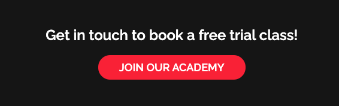

### Home Page
The _Home_ page features a big welcome banner showing an image of one of the classes at the Academy with the big headline and call to action to join the Academy at the center of it.
Below is the quick overview of disciplines that the Academy offers classes in: Brazilian Jiu-Jitsu, Kickboxing and Boxing, and an invitation to read more about them (each discipline links to a specific related section of the _About_ page).
Returning to the _Home_ page is only possible via clicking on the logo or the navigation link in the footer.

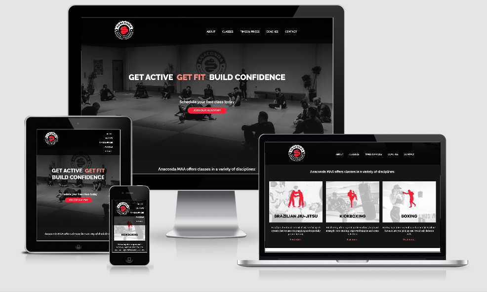

### About Page
The _About_ page, features smaller than _Home_ page main banner (like all the other pages). It contains couple of paragraphs about Anaconda Martial Arts Academy and a small section devoted to each of the martial arts disciplines taught at the school.
Each of those sections has __'Join Our Academy'__ call to action button and an additional link to _Coaches_ page inviting visitors to get some information about the Instructor for the particular discipline.

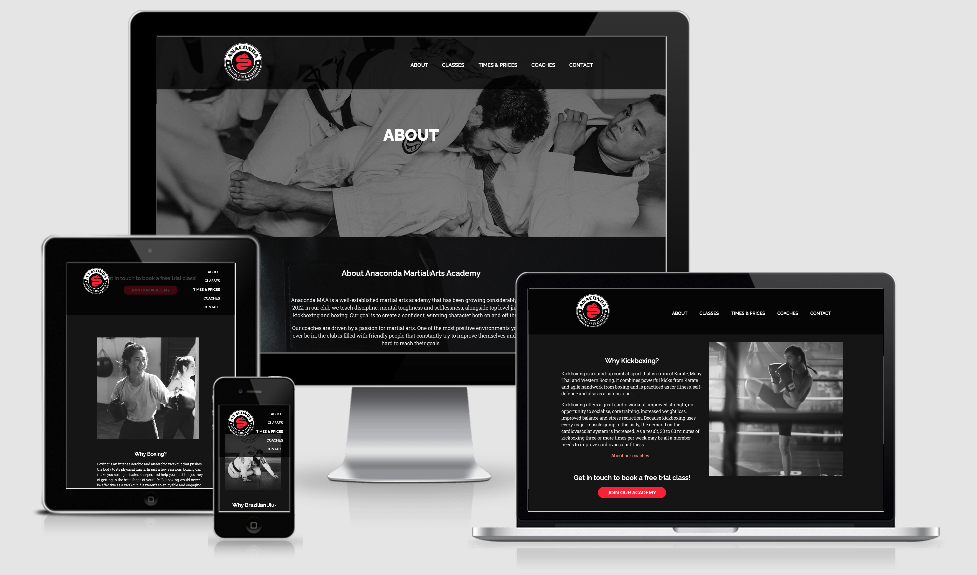

### Classes Page
The _Classes_ page, apart from the main banner, features sections explaining division of classes into different age and skill level groups.
Two sections - Kids & Teens Classes and Adults Classes - have each a responsive diagram of different age/skill levels per discipline and also __'Join Our Academy'__ call to action button and an additional link to the Classes Schedule in the _Times & Prices_ page.
This makes the user flow of checking the suitable age group/ skill level and immediately finding out the times for the suitable classes more fluent.

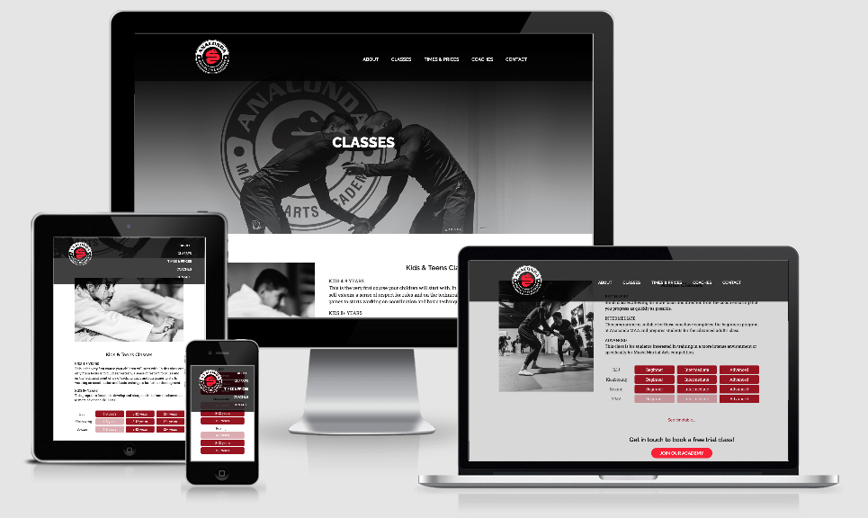

### Times and Prices Page
This pages' main section is a diagram of a full week (Monday to Saturday), with classes put in the appropriate day of the week by hour slots - 6 day columns by 8 hour rows.
This diagram presented a bit of a challenge for the responsive design. The full week diagram (6 columns and 8 rows ) can be displayed only on wide screen sizes.
Once the screen/ viewport size goes below 992px (Bootstrap's grid column large screen size breakpoint), the day columns get stacked on top of each other and empty hour slots (no class taking place at that time) also disappear.
There is a possibility here for future development, creating a filter that highlights only and all classes in the category determined by the filter.

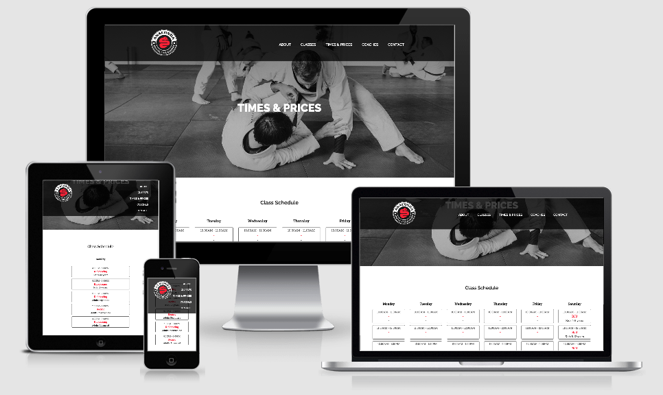

The bottom section of the _Times & Prices_ page is 4 boxes representing different membership options, one of them had to be a distinctive looking offer of a free introductory class.
Each box has a 'Get Started' button that links to _Contact_ page at the moment, expecting visitors to get in touch with the academy through contact channels given on that page in order to sign up and pay for membership.
In the future, the academy owner would like this button to link directly to online sign up and payment feature. 

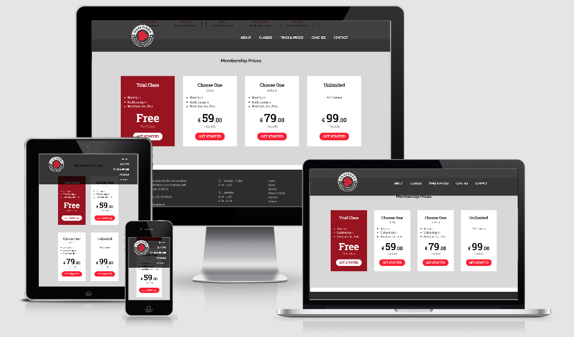

### Coaches Page
The _Coaches_ page, offers short bio on three academy instructors, each of the instructors is a specialist in one of the three martial arts taught in the academy.
The link from each instructor to the corresponding martial art description on _About_ page (and the link back from a martial art to the corresponding instructor) create an easy user flow where visitors by checking the info about the martial art can quickly find out who is teaching it (and vice-versa).
There are 'About (Discipline)...' obvious links created with hover effects, but there are also same links created on the red names of each discipline (no hover effect), underneath the names of instructors. I decided to turn those red names into links, when I realised that I felt like clicking on those words in my own user testing.

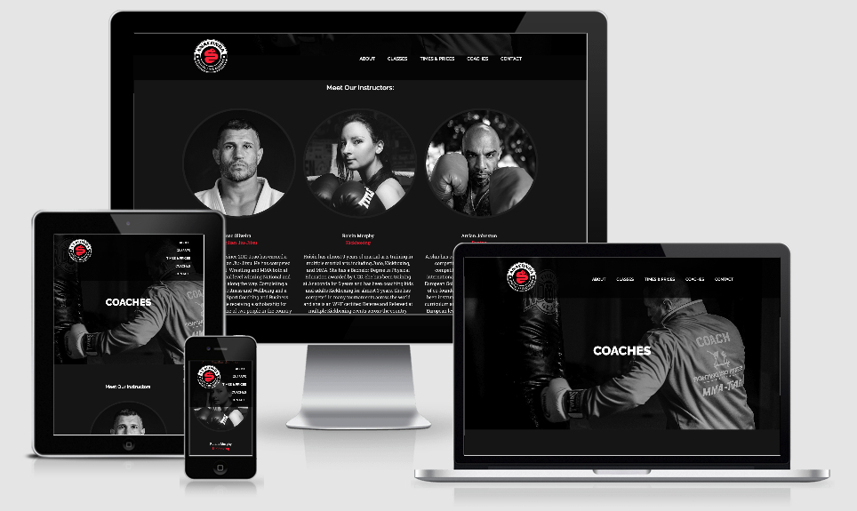

### Contact Page
The _Contact_ page is a destination page for all the __'Join Our Academy'__ call to action buttons.
It contains the two main features:
- Contact Form
- Google Maps Location Map

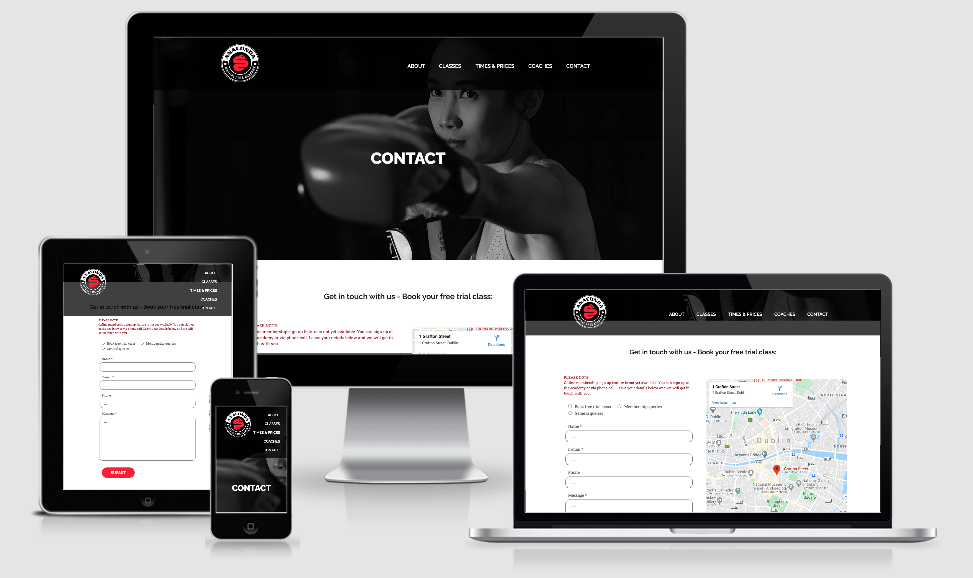

### Contact Form
The business owner expects the following entries in the contact form:
- Radio buttons to state one of the three reasons for getting in touch with the Academy (in order to be able to prioritise potential new members over general queries in times of high volume of incoming messages):
	- Book free trial class
	- Membership queries
	- General queries
- Name
- Email address
- Phone number
- The message

All entry fields except for the phone number are required in order to submit the query.

The online form is not connected to email or any back-end support at the moment (due to unskilled developer).
The 'Submit' button takes the visitor to another page, confirming (unjustifiably) the receipt of the email by the academy and making (baseless) promise of the prompt response.
Completing the back-end support for the form would be an urgent priority needed very soon.
In fact it would be probably problematic to release the website with not functional online form.

__NOTE:__

__! The website should not be deployed in the custom hosted environment before the online query form back-end functionality is added.
If deploying before, the appropriate disclaimer information should be added beside the form or the form should be removed (commented out) for the time being !__

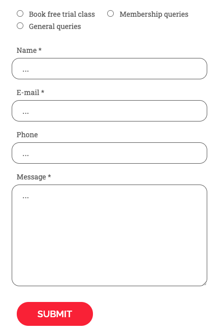

### Google Maps Location Map
The map feature at the moment is an embedded \<iframe>, code generated on [www.maps.ie](https://www.maps.ie/create-google-map/) website and doesn't include the business marker yet.
The proper map with the location marker will have to be added in the next round of development (requires JavaScript and API technologies is what I'm hearing).

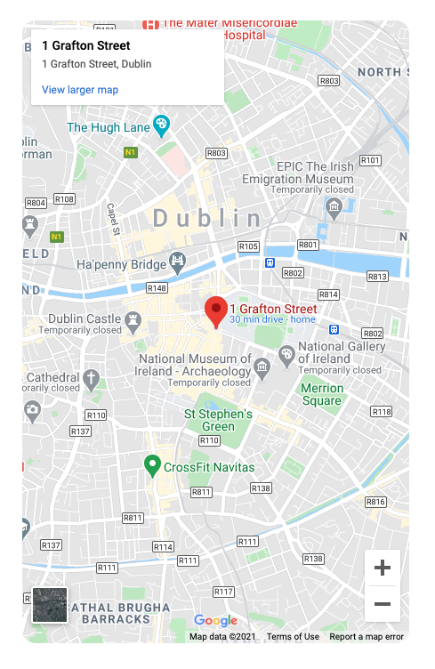

### Favicon
Favicon won't let the the Anaconda MAA website get lost in the sea of open web browser tabs.

### Features to Implement in the Future
- Definitely needed in the near future.
	- Full back-end functionality of the contact form.
	- Google maps with a marker.
	- Online Membership Signup & Payment feature - as a direct link from the Membership Prices boxes on the _Times & Prices_ page.
	- Navbar hidden in the hamburger menu icon - to reduce the size of the real estate taken by the current Navbar.
	- Members testimonials page - currently there are testimonials posted on social media, _"but it would be nice to have them on the website as well"_ (business owner's quote).
- Potentially something to look at in the future.
	- Online Free Trial Class booking - a feature allowing users to pick the class date and time in the online calendar and have the class automatically booked, with confirmation email automatically sent to user.
	- Filters that highlight the selected classes on the Class Schedule calendar - for quick and easy preview.
	Filter classes:
		- filter by discipline
		- filter by age group
		- filter by skill level
		- filter by class time
	- Video Gallery

[Back to top](#contents)

---

## Technologies
### Tools
- [GitHub](https://github.com) was an IDE used for the project.
- [GitPod](https://gitpod.io/workspaces/) was used for version control.
- [Balsamiq](https://balsamiq.com) was used to create low fidelity wireframes.
- [Adobe XD](https://www.adobe.com/ie/products/xd.html) was used to build the high fidelity prototype.
- [Adobe Illustrator](https://www.adobe.com/ie/products/illustrator.html) was used to create the logo and also create/manipulate vector illustration icons and for saving vectors in .svg format.
- [Adobe Photoshop](https://www.adobe.com/ie/products/photoshop.html) was used to edit, crop and save images.
- [Adobe InDesign](https://www.adobe.com/ie/products/indesign.html) was used to create some visuals for this _Readme_ file and InDesign's online publish feature was used to store some of those visuals.
- [Am I Responsive](http://ami.responsivedesign.is) was used to create the images of each page displayed on different screen sizes in this _Readme_ file.

### Libraries
- [Bootstrap](https://getbootstrap.com/) grids were used in particular to create and maintain the design layout across different screen/viewport sizes and make the website responsive easily.
- [Google Fonts](https://fonts.google.com) was used for linking _Raleway_ and _Roboto Slab_ fonts to the website.
- [Font Awesome](https://fontawesome.com) was used for icons in the footer.

### Languages
- HTML
- CSS

[Back to top](#contents)

---

## Testing

### Automated Testing
- [W3C Markup Validator](https://validator.w3.org/) was used for HTML validation:
	- _Home_ page validator result [HERE](https://validator.w3.org/nu/?doc=https%3A%2F%2Flukaszpasich.github.io%2FAnaconda-MAA-MS1%2Findex.html) - Errors: 0, Warnings: 0
	- _About_ page validator result [HERE](https://validator.w3.org/nu/?doc=https%3A%2F%2Flukaszpasich.github.io%2FAnaconda-MAA-MS1%2Fabout.html) - Errors: 0, Warnings: 3
	- _Classes_ page validator result [HERE](https://validator.w3.org/nu/?doc=https%3A%2F%2Flukaszpasich.github.io%2FAnaconda-MAA-MS1%2Fclasses.html) - Errors: 0, Warnings: 2
	- _Times & Prices_ page validator result [HERE](https://validator.w3.org/nu/?doc=https%3A%2F%2Flukaszpasich.github.io%2FAnaconda-MAA-MS1%2Ftimes.html) - Errors: 0, Warnings: 0
	- _Coaches_ page validator result [HERE](https://validator.w3.org/nu/?doc=https%3A%2F%2Flukaszpasich.github.io%2FAnaconda-MAA-MS1%2Fcoaches.html) - Errors: 0, Warnings: 0
	- _Contact_ page validator result [HERE](https://validator.w3.org/nu/?doc=https%3A%2F%2Flukaszpasich.github.io%2FAnaconda-MAA-MS1%2Fcontact.html) - Errors: 12, Warnings: 0 - this is addressed in [Bugs Not Fixed](#bugs-not-fixed) section
	- Online form submit confirmation page validator result [HERE](https://validator.w3.org/nu/?doc=https%3A%2F%2Flukaszpasich.github.io%2FAnaconda-MAA-MS1%2Fsubmit.html) - Errors: 0, Warnings: 0
	
- [W3C CSS Validator](https://jigsaw.w3.org/css-validator/) was used for CSS validation:
	- CSS Validation by URI input result [HERE](https://jigsaw.w3.org/css-validator/validator?uri=https%3A%2F%2Flukaszpasich.github.io%2FAnaconda-MAA-MS1%2Ftimes.html&profile=css3svg&usermedium=all&warning=1&vextwarning=&lang=en) - Errors: 18 - this is addressed in [Bugs Not Fixed](#bugs-not-fixed) section
	- CSS validation by direct input - Errors: 0
	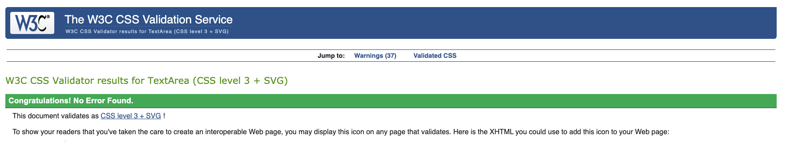

- [Web Accessibility](https://www.webaccessibility.com) was used to validate website's accessibility:
	- _Home_ page accessibility test result [HERE](https://www.webaccessibility.com/results/?url=https%3A%2F%2Flukaszpasich.github.io%2FAnaconda-MAA-MS1%2Findex.html) - Violations: 0, Compliance score: 92%
	- _About_ page accessibility test result [HERE](https://www.webaccessibility.com/results/?url=https%3A%2F%2Flukaszpasich.github.io%2FAnaconda-MAA-MS1%2Fabout.html) - Violations: 0, Compliance score: 92%
	- _Classes_ page accessibility test result [HERE](https://www.webaccessibility.com/results/?url=https%3A%2F%2Flukaszpasich.github.io%2FAnaconda-MAA-MS1%2Fclasses.html) - Violations: 0, Compliance score: 92%
	- _Times & Prices_ page accessibility test result [HERE](https://www.webaccessibility.com/results/?url=https%3A%2F%2Flukaszpasich.github.io%2FAnaconda-MAA-MS1%2Ftimes.html) - Violations: 0, Compliance score: 92%
	- _Coaches_ page accessibility test result [HERE](https://www.webaccessibility.com/results/?url=https%3A%2F%2Flukaszpasich.github.io%2FAnaconda-MAA-MS1%2Fcoaches.html) - Violations: 0, Compliance score: 92%
	- _Contact_ page accessibility test result [HERE](https://www.webaccessibility.com/results/?url=https%3A%2F%2Flukaszpasich.github.io%2FAnaconda-MAA-MS1%2Fcontact.html) - Violations: 0, Compliance score: 92%
	- Online form submit confirmation page validator result [HERE](https://www.webaccessibility.com/results/?url=https%3A%2F%2Flukaszpasich.github.io%2FAnaconda-MAA-MS1%2Fsubmit.html) - Violations: 0, Compliance score: 92%
	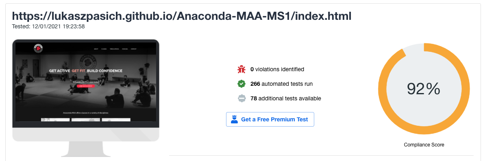

- [Google Mobile Friendly Test](https://search.google.com/test/mobile-friendly) was used to test responsiveness of the website:
	- _Home_ page responsiveness test result [HERE](https://search.google.com/test/mobile-friendly?utm_source=gws&utm_medium=onebox&utm_campaign=suit&id=fN4ChMbnvbmN0fYn-uyn8Q) - Mobile friendly
	- _About_ page responsiveness test result [HERE](https://search.google.com/test/mobile-friendly?utm_source=gws&utm_medium=onebox&utm_campaign=suit&id=w413hZGa3-XTf2ssu1Leyg) - Mobile friendly
	- _Classes_ page responsiveness test result [HERE](https://search.google.com/test/mobile-friendly?utm_source=gws&utm_medium=onebox&utm_campaign=suit&id=1ZYa9EIUpBb3MAvSQU5gNQ) - Mobile friendly
	- _Times & Prices_ page responsiveness test result [HERE](https://search.google.com/test/mobile-friendly?utm_source=gws&utm_medium=onebox&utm_campaign=suit&id=9nJ99DHXlCHouplKiaG1iQ) - Mobile friendly
	- _Coaches_ page responsiveness test result [HERE](https://search.google.com/test/mobile-friendly?utm_source=gws&utm_medium=onebox&utm_campaign=suit&id=q0v0Omo-oSdwVjgrRLb-Dw) - Mobile friendly
	- _Contact_ page responsiveness test result [HERE](https://search.google.com/test/mobile-friendly?utm_source=gws&utm_medium=onebox&utm_campaign=suit&id=c4H0GTQxk75z332IJSwhWA) - Mobile friendly
	- Online form submit confirmation page responsiveness result [HERE](https://search.google.com/test/mobile-friendly?utm_source=gws&utm_medium=onebox&utm_campaign=suit&id=vt5fu_cRGl-jErjNM74UpQ) - Mobile friendly
	
	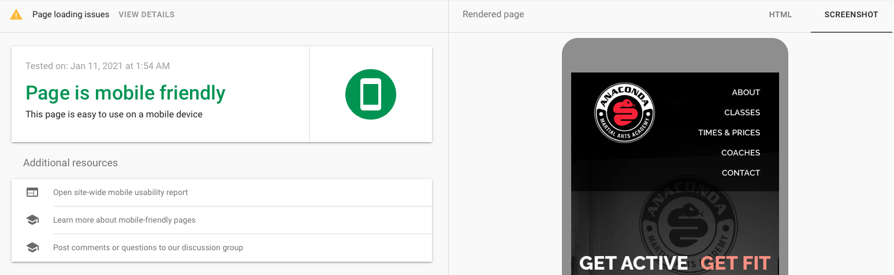
	
	- All pages came with _Page loading issue_ warning, but I didn't find any element's on the page affected.
	
### UX Testing
#### User Stories Testing

1. As a user of the website I want the information to be laid out clearly, visually structured in a way that makes sense, so that I am not confused by it and put off from using the website.

	- The structure of each page is simple: the navigation bar on the top, followed by the main banner clearly stating what page the user is on (the name is unambiguous and the user should be able to know what to expect on the page just from it),
	below is the main content of the page, with the last thing on the bottom being the footer.
	- The structure is repeated on all of the pages, therefore it is easy to learn.
	- Consistent layout, fonts, typography and colours contributes to making visitors quickly comfortable with using the website and getting the information they want.
	- Each piece of information is supported by an image that contributes to better understanding of the context.
	
2. As a user of the website I want it to be easy to navigate, so that I can find what I'm looking for easily.

	- The navigation bar is simple and to the point: the logo on the left, navigation links to the right.
	- The navigation bar is fixed on the top so that the navigation links are always available on the screen.
	- In case of user scrolling to the bottom of the screen to the footer, there is no need for moving the mouse to the top of the viewport for navigation links as they are also present in the footer.
	- Every link on the website has a distinctive look and/or the colour and/or the positioning, so that it is clear for the user which elements are links.
	- Every link in the website with 2 exceptions has a hover action, so that it is clear for the user which elements are links.
	One of the exceptions is the logo - users don't expect it to have any hover action, yet they generally would expect the logo to link to _Home_ page.
	The other exception is in the _Coaches_ page, explained [here](#coaches-page), provides for the good UX.
	- All links have good descriptions or unambiguous look, it is never a mystery for the user where are they going to end up by clicking on link.

3. As a novice to martial arts, I would like to find out what skill levels the school caters for, so that I'm encouraged to start the training and won't feel intimidated.

	- There are very well explained skill levels per each discipline on the _Classes_ page.
	- The contact form provided on _Contact_ page can be used to find out more information. 
	
4. As someone with previous experience in martial arts, I want to make sure that the school provides training in the full suit of Mixed Martial Art disciplines
and that instructors are experienced and at a high level of competency, so that I could potentially get to the competing level in the Mixed Martial Arts.

	- There is a comprehensive information about all disciplines that the academy teaches on the _About_ page.
	- The _Classes_ page explains the skill levels, the user can also find out that the most advanced members can practice in the MMA classes with all disciplines combined.
	- There is a good information about instructors on the _Coaches_ page. Instructors' bios include their experience in martial arts as wells as martial arts teaching.
	- There is a shortcut internal link between information about a particular martial art and the instructor that teaches it (and vice-versa) that is a good solution for this particular user story.
	- The contact form provided on _Contact_ page can be used to find out more information.

5. As a parent of a primary school age child, I want to find out if the school provides classes for different age groups, to make sure that my child could train with the peers at the similar level of development.

	- There are very well explained age groups for Kids & Teens classes on the _Classes_ page.
	- The image from the kids class in that section also reinforces the message that Anaconda academy accepts children from the very young ages.
	- The contact form provided on _Contact_ page can be used to find out more information. 
	
6. As a busy working adult who would like to start the training, I expect to find a time table of classes, to make sure first of all that it's is possible for me to attend the classes time-wise before I get in touch and start the process of becoming a member.

	- The timetable on the 'Times & Prices' page has a clearly laid out schedule of classes per day/ per hour, with the discipline + age group/ skill level clearly indicated.
	- Once the user identifies the class they want to participate in (discipline + age group/ skill level) on the _Classes_ page, they will be able to find the class their interested in in the Class Schedule on _Times & Prices_ page.
	- There is a shortcut internal link from _Classes_ page to _Times & Prices_ page timetable to suggest the flow described in the previous point.
	- Anaconda MAA opening hours are indicated in the footer, the user can contact academy within those hours (personally visiting or by phone) or send an email/ online contact form to find out more.
	
7. As a person who needs to budget carefully, I would like to know upfront the membership prices, so that I can make a decision based on that piece of information first, before I engage with the academy and start the process of becoming a member.

	- As one of the pages (and also a navigation link) is called _Times & Prices_ it isn't a matter of a long search to discover the prices.
	- _Times & Prices_ page provides the section with membership options with prices clearly indicated.

8. As a user accessing this site from a mobile phone or tablet, I want the site to be responsive, so that it is easy to navigate and use on smaller devices.

	- The website has passed the responsiveness test in [Automated Testing - Google Mobile Friendly Test](#automated-testing) and in the [Manual Testing](#manual-testing).
	- The design and layout has been carefully planned to be as strong on smaller devices as on desktop and laptop computers. 

9. As a potential member trying to get in touch with the academy, I expect some sort of feedback or acknowledgement of my online query, so that I know it has been received by the school and I can expect it is being processed.

	- The users who have decided to become members have a clear and easy pathway to do so presented for them. Almost every page has a distinctive call to action button for joining the academy. This button is unmissable and leads to the _Contact_ page.
	- From the _Contact_ page there are few options to get in touch with the academy: physical address, phone number, email and contact form.
	- The contact form let's the user know which fields are required to fill out and upon the submission of the online form the page with the acknowledgement of query receipt is displayed.

10. As a returning visitor, I expect to be able to check if the times of the classes have changed, look up information about the new instructors and be able to find the social media links to check for new posts, images and videos published bt the school.

	- Anaconda MAA website will be regularly updated.
	- The links to the academy's social media channels are in the footer (generally where they would be expected).

### Manual Testing
#### Elements and Links (in various screen sizes) Working Correctly Check
- Navigation Bar
	- Navigation bar stays in fixed position in all pages - YES
	- Logo CLICK brings visitor to _Home page_- YES
	- _About_ navigation link HOVER action on wide screen size (underline from center) works - YES
	- _About_ navigation link HOVER action on narrow screen sizes (text colour change) works - YES
	- _About_ navigation link CLICK brings visitor to _About_ page - YES
	- _Classes_ navigation link HOVER action on wide screen size (underline from center) works - YES
	- _Classes_ navigation link HOVER action on narrow screen sizes (text colour change) works - YES
	- _Classes_ navigation link CLICK brings visitor to _Classes_ page - YES
	- _Times & Prices_ navigation link HOVER action on wide screen size (underline from center) works - YES
	- _Times & Prices_ navigation link HOVER action on narrow screen sizes (text colour change) works - YES
	- _Times & Prices_ navigation link CLICK brings visitor to _Times & Prices_ page - YES
	- _Coaches_ navigation link HOVER action on wide screen size (underline from center) works - YES
	- _Coaches_ navigation link HOVER action on narrow screen sizes (text colour change) works - YES
	- _Coaches_ navigation link CLICK brings visitor to _Coaches_ page - YES
	- _Contact_ navigation link HOVER action on wide screen size (underline from center) works - YES
	- _Contact_ navigation link HOVER action on narrow screen sizes (text colour change) works - YES
	- _Contact_ navigation link CLICK brings visitor to _Contact_ page - YES
	- Navigation bar colapses to stacked, vertical version on smaller screen sizes/ devices - YES
	
- Footer
	- Icons (Font Awesome) load properly - YES
	- _Home_ link HOVER action (text colour change) works - YES
	- _Home_ link CLICK brings visitor to _Home_ page - YES
	- _About_ link HOVER action (text colour change) works - YES
	- _About_ link CLICK brings visitor to _About_ page - YES
	- _Classes_ link HOVER action (text colour change) works - YES
	- _Classes_ link CLICK brings visitor to _Classes_ page - YES
	- _Times & Prices_ link HOVER action (text colour change) works - YES
	- _Times & Prices_ link CLICK brings visitor to _Times & Prices_ page - YES
	- _Coaches_ link HOVER action (text colour change) works - YES
	- _Coaches_ link CLICK brings visitor to _Coaches_ page - YES
	- _Contact_ link HOVER action (text colour change) works - YES
	- _Contact_ link CLICK brings visitor to _Contact_ page - YES
	- Twitter icon HOVER action (colour change) works - YES
	- Twitter icon CLICK opens Twitter page in new browser tab - YES
	- Pinterest icon HOVER action (colour change) works - YES
	- Pinterest icon CLICK opens Pinterest page in new browser tab - YES
	- Facebook icon HOVER action (colour change) works - YES
	- Facebook icon CLICK opens Facebook page in new browser tab - YES
	- Instagram icon HOVER action (colour change) works - YES
	- Instagram icon CLICK opens Instagram page in new browser tab - YES
	- Youtube icon HOVER action (colour change) works - YES
	- Youtube icon CLICK opens Youtube page in new browser tab - YES
	- Elements of the footer behave as predicted at each intended screen size breakpoint - YES

- _Home_ Page
	- All fonts load properly - YES
	- Main banner loads with reasonable speed - YES
	- Main banner not pixelated - YES
	- All other images on the page not pixelated - YES
	- 'Join Our Academy' button HOVER action (colour change) works - YES
	- 'Join Our Academy' button CLICK brings visitor to _Contact_ page - YES
	- Brazilian Jiu-Jitsu image HOVER action (opacity drop) works - YES
	- Brazilian Jiu-Jitsu 'Read more...' text link HOVER action (text colour change) works - YES
	- Brazilian Jiu-Jitsu image and 'Read more...' text CLICK brings visitor to the corresponding part of the _About_ page - YES
	- Kickboxing image HOVER action (opacity drop) works - YES
	- Kickboxing 'Read more...' text link HOVER action (text colour change) works - YES
	- Kickboxing image and 'Read more...' text CLICK brings visitor to the corresponding part of the _About_ page - YES
	- Boxing image HOVER action (opacity drop) works - YES
	- Boxing 'Read more...' text link HOVER action (text colour change) works - YES
	- Boxing image and 'Read more...' text CLICK brings visitor to the corresponding part of the _About_ page - YES
	- Page elements behave as intended in smaller screen sizes - YES

- _About_ Page
	- All fonts load properly - YES
	- Main banner loads with reasonable speed - YES
	- Main banner not pixelated - YES
	- All other images on the page not pixelated - YES
	- All 'About our coaches...' text links bring visitors to the corresponding part of the _Coaches_ page - YES
	- All 'Join Our Academy' buttons HOVER action (colour change) works - YES
	- All 'Join Our Academy' buttons CLICK brings visitor to _Contact_ page - YES
	- Page elements behave as intended in smaller screen sizes - YES
		
- _Classes_ Page
	- All fonts load properly - YES
	- Main banner loads with reasonable speed - YES
	- Main banner not pixelated - YES
	- All other images on the page not pixelated - YES
	- All 'See timetable...' text links bring visitors to the _Times & Prices_ page - YES
	- All 'Join Our Academy' buttons HOVER action (colour change) works - YES
	- All 'Join Our Academy' buttons CLICK brings visitor to _Contact_ page - YES
	- Page elements behave as intended in smaller screen sizes - YES

- _Times & Prices_ Page
	- All fonts load properly - YES
	- Main banner loads with reasonable speed - YES
	- Main banner not pixelated - YES
	- Class Schedule section - empty hour slots disappear from the schedule in small screen sizes - YES
	- Membership Prices section - All 'Get Started' buttons HOVER action (colour change) works - YES
	- Membership Prices section - All 'Get Started' buttons CLICK brings visitor to _Contact_ page - YES
	- Page elements behave as intended in smaller screen sizes - YES

- _Coaches_ Page
	- All fonts load properly - YES
	- Main banner loads with reasonable speed - YES
	- Main banner not pixelated - YES
	- All coaches images on the page not pixelated - YES
	- All coaches images HOVER effect (subtle zoom in) works - YES  - small issue in Safari browser, addressed in [Bugs Not Fixed](#bugs-not-fixed) section
	- Brazilian Jiu-Jitsu red text CLICK brings visitor to the corresponding part of the _About_ page - YES
	- Kickboxing red text CLICK brings visitor to the corresponding part of the _About_ page - YES
	- Boxing red text CLICK brings visitor to the corresponding part of the _About_ page - YES
	- 'About Brazilian Jiu-Jitsu...' text link HOVER action (text colour change) works - YES
	- 'About Brazilian Jiu-Jitsu...' text link CLICK brings visitor to the corresponding part of the _About_ page - YES
	- 'About Kickboxing...' text link HOVER action (text colour change) works - YES
	- 'About Kickboxing...' text link CLICK brings visitor to the corresponding part of the _About_ page - YES
	- 'About Boxing...' text link HOVER action (text colour change) works - YES
	- 'About Boxing...' text link CLICK brings visitor to the corresponding part of the _About_ page - YES
	- Page elements behave as intended in smaller screen sizes - YES

- _Contact_ Page
	- All fonts load properly - YES
	- Main banner loads with reasonable speed - YES
	- Main banner not pixelated - YES
	- Contact form - radio buttons work properly (only one selectable) - YES
	- Contact form - all entry fields fillable - YES
	- Contact form - all required fields need to be filled before 'Submit' button action can be performed - YES
	- Contact form - email field accepts email format entry only for the 'Submit' button action to be possible to be performed - YES
	- Contact form - 'Submit' button HOVER action (colour change) works - YES
	- Contact form - 'Submit' button CLICK brings visitor to the query receipt confirmation page - YES
	- Google map - behaviour (zoom in, zoom out, scroll, show satellite view) correct - YES
	- Google map - 'View larger map' and 'Directions' links open in new browser tab - YES
	- Page elements behave as intended in smaller screen sizes - YES

- Online form receipt confirmation page
	- 'Back to home page' text link HOVER effect (text colour change) works - YES
	- 'Back to home page' text link CLICK brings visitor to the _Home_ page - YES

#### Various Internet Browsers Check

Website has been tested on the following Internet Browsers:

- Google Chrome - no issues detected
- Safari - small issue on _Coaches_ page, addressed in [Bugs Not Fixed](#bugs-not-fixed) section
- Mozilla Firefox - no issues detected
- Microsoft Edge - no issues detected
	
#### Various Devices Check

Due to limited access to devices, the website has been only checked on Desktop, Laptop and iPhone6. No issues specific to devices were discovered.
	
### Bugs

#### Bugs Fixed
1.	- PROBLEM (came up as HTML validator error): an ID and FOR attributes must not contain whitespce.
	- SOLUTION: Making the ID hyphenated removed this error for me from the HTML validator. 

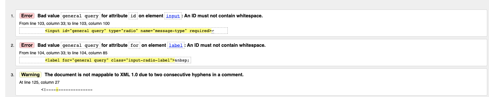

2.	- PROBLEM (came up as HTML validator error): element \
 not allowed as child of element \<h1>.
	- SOLUTION: I have changed \<h1> into \
 (\
 can be a child of \
 of course), but the downside is that I don't have \<h1> headings anymore, which is probably not the best practice from SEO point of view.
I will have to structure my code better for next projects. 

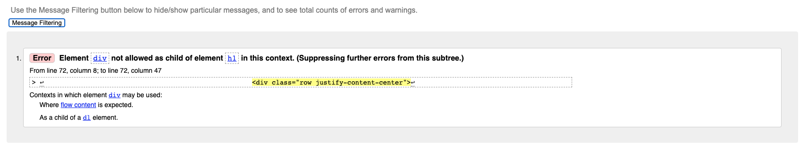

3.	- PROBLEM (came up as web accessibility violations): __aria-hidden="true"__ attribute set on my social media icons.
	- SOLUTION: Setting __aria-label__ attribute for each icon solved the violations from the accessibility test.

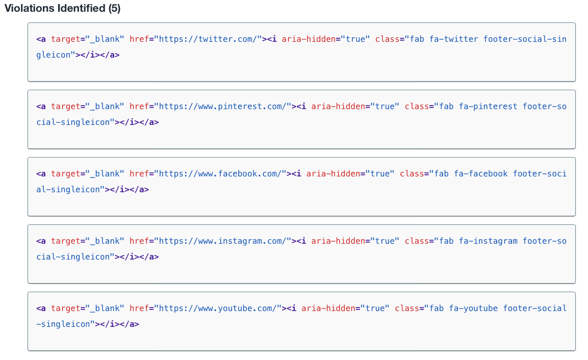

4.	- PROBLEM: I couldn't embed link from google maps on my page using \<iframe>. The screenshot of the error that came up in the Dev Tools in my browser is below.
I read a bit about 'X-Frame-Options', but decided that this wasn't my level of competence yet and I looked for different solution.
	- SOLUTION: I used Google Maps generator website, details [here](#code), that ironically gave me an \<iframe> code line (but different, one that worked).
	I was able to feature the google map on the website now and get rid of this problem, however (for the second time irony) this code gave me bunch of errors somewhere else - this is addressed in [Bugs Not Fixed](#bugs-not-fixed) section.

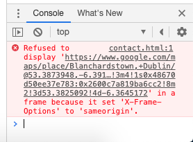

5.	- PROBLEM: While testing the links I discovered that I couldn't click on the logo in smaller screen sizes in order to go to _Home_ page (in fact I was clicking on one of the navigation links instead).
It turned out that the container element of the navigation links was going over the logo (I added the red background to that element to see the problem better, screenshots below).
As the \<navbar> element itself (black top bar with some transparency) had already some __z-index__ value assigned in order to always stay on the top, the elements inside it didn't want to listen to my __z-index__ requests (I was trying to give the logo a higher __z-index__ than the navigation links).
	- SOLUTION: The help came from my mentor. I never thought about giving the __z-index__ negative values, but giving the navigation links __z-index: -1;__ value actually sent them underneath the logo.

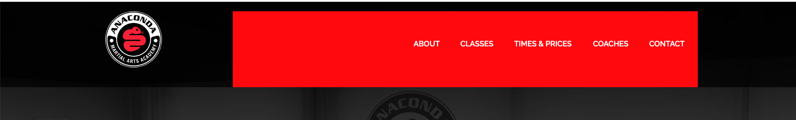

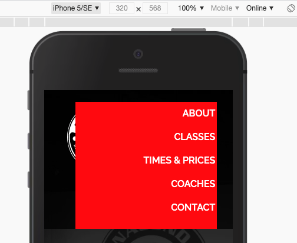

6.	- PROBLEM: The hover effect on images of instructors (the subtle zoom-in) has been completely breaking on smaller screen sizes/ devices in all browsers.
	The circle and the image were scaling at different times. I was trying to remove the classes responsible for the effect at certain media query,
	but other parts were getting affected and because this was a "borrowed" code I didn't have 100% understanding and control of it.
	- SOLUTION: After many trials of different things to solve the problem, it occurred to me that I could leave the effect as is but set the __scale: 1;__ on the effect animation at certain media queries, so it basically wouldn't change at all... and it worked!

#### Bugs not Fixed
1.	- PROBLEM (came up as HTML validator errors): The \<iframe> code line generated on Google Maps generator gave me 12 errors in the HTML validator (screenshots below).
I didn't want to touch this code at this time as ultimately it did make the Google Map work on my website and I wasn't sure what the solution would be, Im suspecting that creating CSS rules for the \<iframe> element could solve some of the problems.

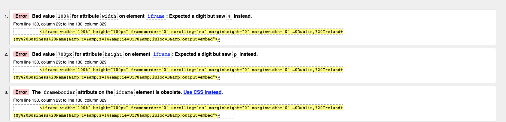
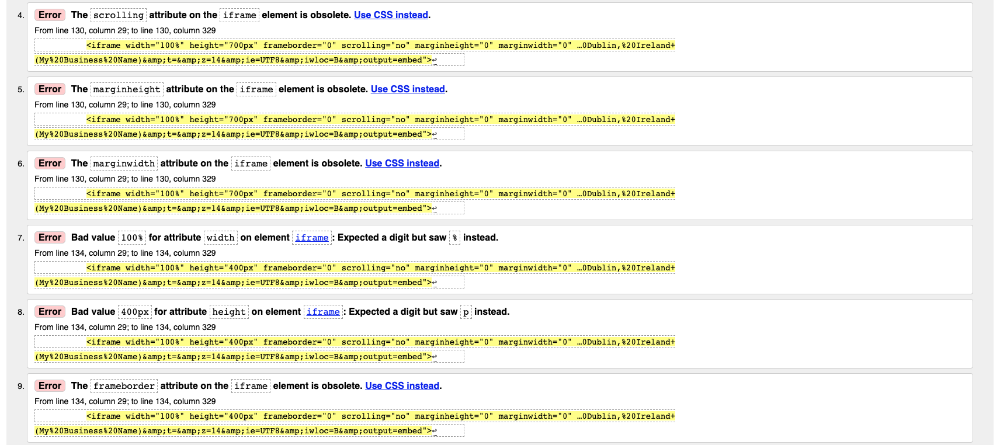
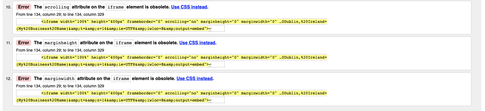

2.	- PROBLEM: 18 errors thrown on CSS Validator (screenshot below or results [here](https://jigsaw.w3.org/css-validator/validator?uri=https%3A%2F%2Flukaszpasich.github.io%2FAnaconda-MAA-MS1%2Ftimes.html&profile=css3svg&usermedium=all&warning=1&vextwarning=&lang=en)) and it looks like all of them came from bootstrap.
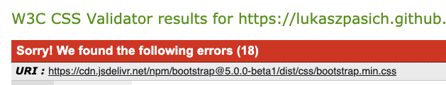

        In a search for the solution online, I found the comment on [www.reddit.com](https://www.reddit.com/r/bootstrap/comments/ajo5xw/getting_error_while_validating_bootstrapmincss_in/) in the post about the similar problem, the comment read: _"It seems like the validator isn't updated to recognize the new CSS variables feature yet. You're probably fine to ignore any of that if it's coming from the Bootstrap files."_ (screenshot below).
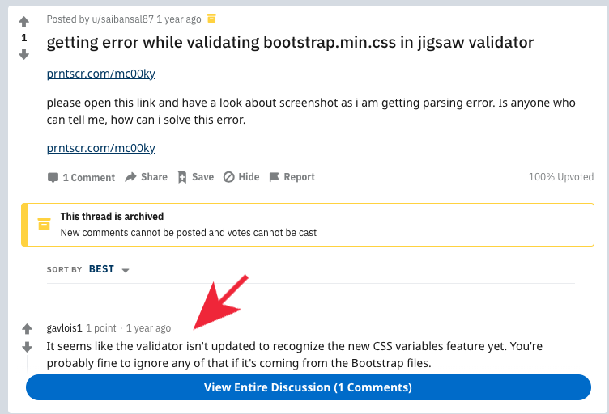

3.	- PROBLEM: The hover effect (subtle zoom-in) on images of instructors on _Coaches_ page is slightly broken in Safari web browser (screenshot below), which must be due to some default browser styles.

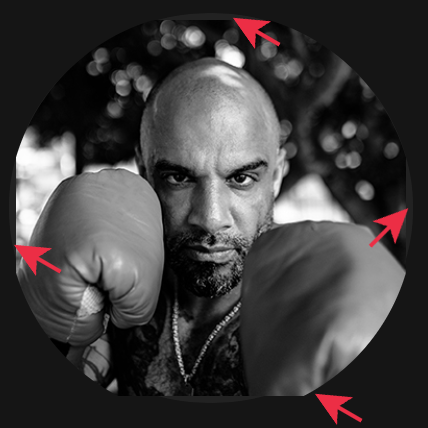

[Back to top](#contents)

---

## Deployment

### GitHub Pages

The project was deployed to GitHub Pages using the following steps...

1. Log in to GitHub and locate the [GitHub Repository](https://github.com).
2. At the top of the Repository, locate the _Settings_ button on the menu and click on it.

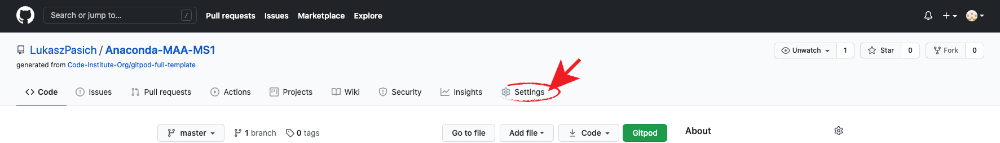

3. Scroll down the Settings page until you locate the _GitHub Pages_ section.

4. Under _Source_, click the dropdown called _None_ and select _Master Branch_.

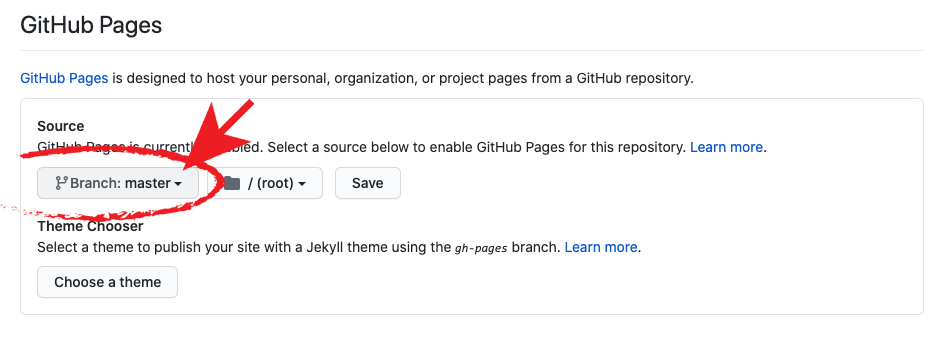

5. The page will automatically refresh.
6. Scroll back down through the page to locate the now published site link in the _GitHub Pages_ section.

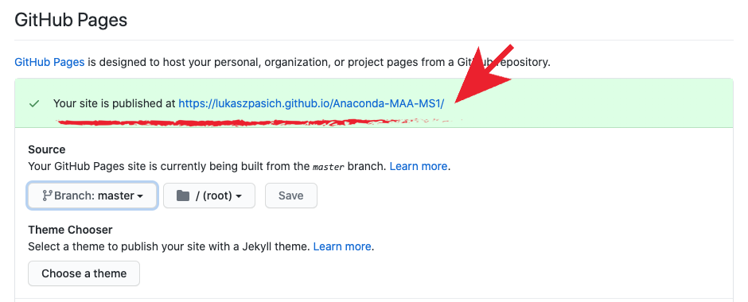

7. The project has been now deployed - the link can be opened in the browser.

[Back to top](#contents)

---

